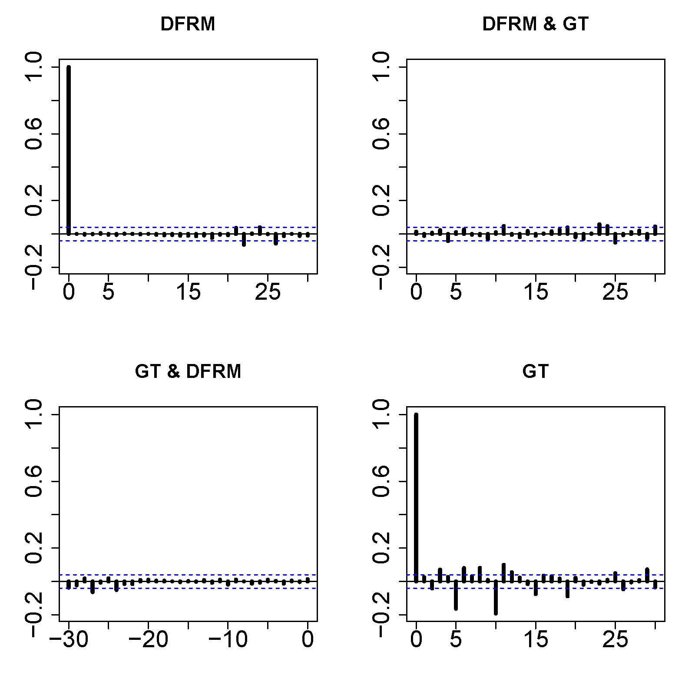
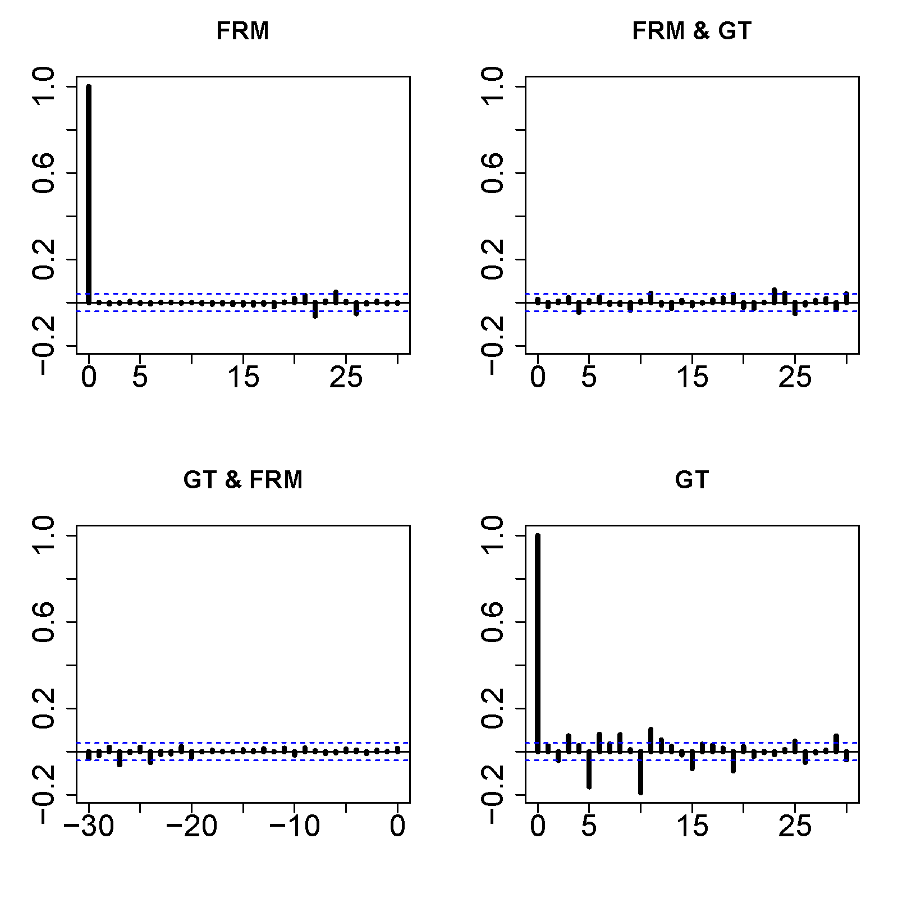
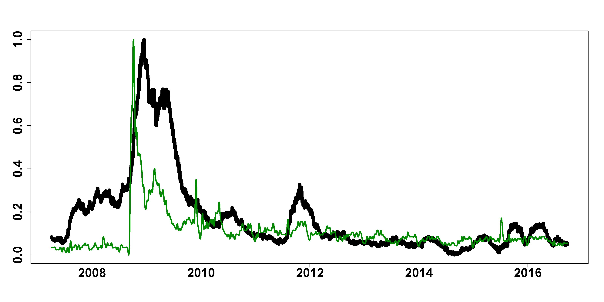

[](http://quantlet.de/)

## [](http://quantlet.de/) **FRM_GT** [](http://quantlet.de/)

```yaml

Name of Quantlet : FRM_GT

Published in : 'FRM: A Financial Risk Meter based on penalizing tail events occurrence'

Description : 'compare the FRM and Google Trends (GT) by using correlation analysis and causality
analysis, plot the FRM and GT series, plot the autocorrelation function of residuals'

Keywords : plot, acf, causality, correlation, residuals, risk, penalty, tail

See also : FRM_VIX, FRM_SRISK

Author : Lining Yu

Submitted : THU, December 15 2016 by Lining Yu

Datafile : FRM_VIX_SRISK_GT.csv

```








### R Code:
```r
rm(list = ls())
graphics.off()
# set the working directory setwd('C:/...')
libraries = c("vars", "stats", "tseries", "quantmod", "tsDyn", "dygraphs", "urca", 
    "xtable")
lapply(libraries, function(x) if (!(x %in% installed.packages())) {
    install.packages(x)
})
lapply(libraries, library, quietly = TRUE, character.only = TRUE)
data = read.csv("FRM_VIX_SRISK_GT.csv")
dt = as.Date(data[, 1], format = "%d/%m/%Y")
FRM = as.matrix(data[, 2])
adf.test(FRM)
GT = as.matrix(data[, 5])
adf.test(GT)

########### scale variables #################
GT = (GT - min(GT))/(max(GT) - min(GT))
FRM = (FRM - min(FRM))/(max(FRM) - min(FRM))

########### plot FRM and VIX ################
plot(dt, FRM, ylab = "", xlab = "", pch = 16, col = "white", , cex.axis = 2, font.axis = 2, 
    type = "l")
lines(dt, FRM, col = "black", lwd = 8)
lines(dt, GT, col = "green4", lwd = 3)

########## Correlation analysis #############
cor(FRM, GT, method = "pearson")
cor.test(FRM, GT, method = "pearson")

####### Causality FRM and GT ###############
VAR = cbind(FRM, GT)
colnames(VAR) = c("FRM", "GT") 
VARselect(VAR, lag.max = 20, type = "both")
varest1 = VAR(VAR, p = 20, type = "both") 
resid = residuals(varest1)
serial.test(varest1, lags.pt = 20, type = "PT.asymptotic")
serial.test(varest1, lags.pt = 20, type = "PT.adjusted")
serial.test(varest1, lags.pt = 20, type = "BG")
serial.test(varest1, lags.pt = 20, type = "ES")
causality(varest1, cause = "FRM")$Granger
causality(varest1, cause = "GT")$Granger
acf(resid, ylab = "", cex.axis = 2, lwd = 4, xlab = "", cex.main = 1.6)[1]

####### Causality DFRM and GT ###############
adf.test(diff((FRM)))
VAR = cbind(diff((FRM)), GT[-1])
colnames(VAR) = c("DFRM", "GT")
VARselect(VAR, lag.max = 20, type = "both")
varest1 = VAR(VAR, p = 20, type = "both")
resid = residuals(varest1)
serial.test(varest1, lags.pt = 20, type = "PT.asymptotic")
serial.test(varest1, lags.pt = 20, type = "PT.adjusted")
serial.test(varest1, lags.pt = 20, type = "BG")
serial.test(varest1, lags.pt = 20, type = "ES")
causality(varest1, cause = "DFRM")$Granger
causality(varest1, cause = "GT")$Granger
acf(resid, ylab = "", cex.axis = 2, lwd = 4, xlab = "", cex.main = 1.6)[1]


```
