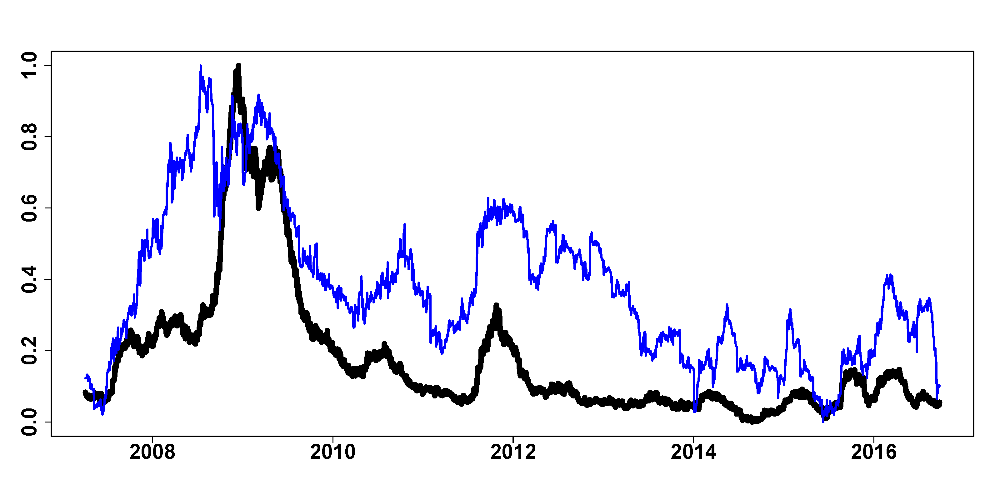

[](http://quantlet.de/)

## [](http://quantlet.de/) **FRM_SRISK** [](http://quantlet.de/)

```yaml

Name of Quantlet : FRM_SRISK

Published in : 'FRM: A Financial Risk Meter based on penalizing tail events occurrence'

Description : 'compare the FRM and SRISK by using correlation analysis and causality analysis, plot
the FRM and SRISK series'

Keywords : plot, compare, causality, correlation, financial, risk, penalty, tail

See also : FRM_VIX, FRM_GT

Author : Lining Yu

Submitted : THU, December 15 2016 by Lining Yu

Datafile : FRM_VIX_SRISK_GT.csv

```




### R Code:
```r
rm(list = ls())
graphics.off()
# set the working directory setwd('C:/...')
libraries = c("vars", "stats", "tseries", "quantmod", "tsDyn", "dygraphs", "urca", 
    "xtable")
lapply(libraries, function(x) if (!(x %in% installed.packages())) {
    install.packages(x)
})
lapply(libraries, library, quietly = TRUE, character.only = TRUE)
data = read.csv("FRM_VIX_SRISK_GT.csv")
dt = as.Date(data[, 1], format = "%d/%m/%Y")
FRM = as.matrix(data[, 2])
adf.test(FRM)
SRISK = as.matrix(data[, 4])
adf.test(SRISK)

########### scale variables #################
SRISK = (SRISK - min(SRISK))/(max(SRISK) - min(SRISK))
FRM = (FRM - min(FRM))/(max(FRM) - min(FRM))

########### plot FRM and SRISK ################
plot(dt, FRM, ylab = "", xlab = "", pch = 16, col = "white", , cex.axis = 2, font.axis = 2, 
    type = "l")
lines(dt, FRM, col = "black", lwd = 8)
lines(dt, SRISK, col = "blue", lwd = 3)

########## Correlation analysis #############
cor(FRM, SRISK, method = "pearson")
cor.test(FRM, SRISK, method = "pearson")

####### Causality FRM and SRISK ###############
adf.test(SRISK)
### from FRM to SRISK ###
lm_SF = lm(SRISK ~ FRM)
summary(lm_SF)
res_lm_SF = resid(lm_SF)
res.ADF <- ur.df(res_lm_SF, type = "none", selectlags = "AIC")
summary(res.ADF)

### from SRISK to FRM ###
lm_FS = lm(FRM ~ SRISK)
summary(lm_FS)
res_lm_FS = resid(lm_FS)
res.ADF <- ur.df(res_lm_FS, type = "none", selectlags = "AIC")
summary(res.ADF)


```
