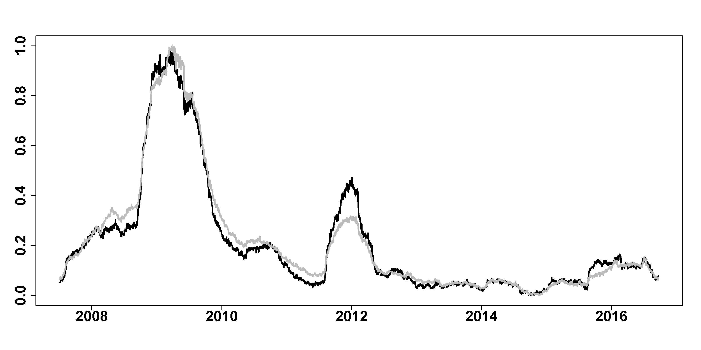

[](http://quantlet.de/)

## [](http://quantlet.de/) **FRM_compare_nf** [](http://quantlet.de/)

```yaml

Name of Quantlet : FRM_compare_nf

Published in : 'FRM: A Financial Risk Meter based on penalizing tail events occurrence'

Description : plot FRM with 100 firms and with 200 firms, show the correlation of them

Keywords : plot, comparison, firms, financial, risk, penalty, tail, correlation

See also : FRM_compare_ws, FRM_compare_nf

Author : Lining Yu

Submitted : THU, December 15 2016 by Lining Yu

Datafile : FRM_comparison.csv

```




### R Code:
```r
rm(list = ls())
graphics.off()
# set the working directory setwd('C:/...')

##################### plot FRM with 100 firm and 200 firms ############
data = read.csv("FRM_comparison.csv")
FRM200 = as.vector(read.csv("FRM_comparison.csv")[, 3])
FRM100 = as.matrix(read.csv("FRM_comparison.csv")[, 4])
FRM100 = (FRM100 - min(FRM100))/(max(FRM100) - min(FRM100))
FRM200 = (FRM200 - min(FRM200))/(max(FRM200) - min(FRM200))
dt = as.Date(data[, 1], format = "%d/%m/%Y")
plot(dt, FRM100, type = "l", lwd = 3, xlab = "", ylab = "", cex.axis = 2, font.axis = 2)
lines(dt, FRM200, col = "grey", lwd = 3)

##################### correlation of FRM with 100 firm and 200 firms ##
cor(FRM100,FRM200)
```
