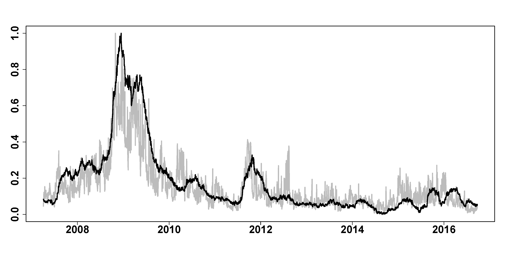

[](http://quantlet.de/)

## [](http://quantlet.de/) **FRM_compare_of** [](http://quantlet.de/)

```yaml

Name of Quantlet : FRM_compare_of

Published in : 'FRM: A Financial Risk Meter based on penalizing tail events occurrence'

Description : plot FRM and lambda of one firm, i.e. the lambda series of Wells Fargo (WFC)

Keywords : plot, comparison, firm, financial, risk, tail, LASSO, L1-norm penalty

See also : FRM_compare_nf, FRM_compare_ws

Author : Lining Yu

Submitted : THU, December 15 2016 by Lining Yu

Datafile : FRM_VIX_SRISK_GT.csv, lambdas_100firms2.csv

```




### R Code:
```r
rm(list = ls())
graphics.off()
# set the working directory setwd('C:/...')

##################### plot one firm's lambda and FRM ####
data = read.csv("FRM_VIX_SRISK_GT.csv")
dt = as.Date(data[, 1], format = "%d/%m/%Y")
FRM = as.matrix(data[, 2])
FRM = (FRM - min(FRM))/(max(FRM) - min(FRM))

# read the lambda series of Wells Farg (WFC) #####
of = read.csv("lambdas_100firms2.csv")[13:2398, 2]
of = (of - min(of))/(max(of) - min(of))
plot(dt, of, col = "grey", type = "l", lwd = 3, xlab = "", ylab = "", cex.axis = 2, 
    font.axis = 2)
lines(dt, FRM, col = "black", lwd = 3)

```
