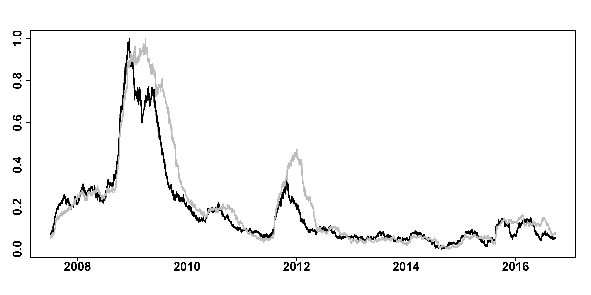
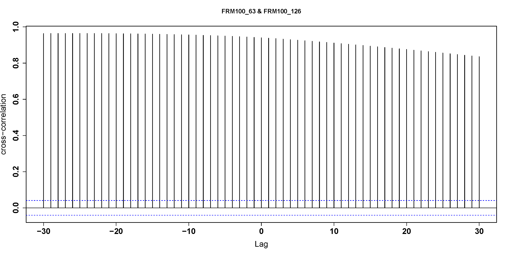

[](http://quantlet.de/)

## [](http://quantlet.de/) **FRM_compare_ws** [](http://quantlet.de/)

```yaml

Name of Quantlet : FRM_compare_ws

Published in : 'FRM: A Financial Risk Meter based on penalizing tail events occurrence'

Description : 'plot 100 firms based FRM with window size 63 and window size 126, plot the cross
correlation of them'

Keywords : plot, comparison, firms, financial, risk, penalty, tail, correlation

See also : FRM_compare_nf, FRM_compare_of

Author : Lining Yu

Submitted : THU, December 15 2016 by Lining Yu

Datafile : FRM_comparison.csv

```






### R Code:
```r
rm(list = ls())
graphics.off()
# set the working directory setwd('C:/...')

##################### plot FRM with different window size ############
data = read.csv("FRM_comparison.csv")
FRM100_63 = as.vector(read.csv("FRM_comparison.csv")[, 2])
FRM100_126 = as.matrix(read.csv("FRM_comparison.csv")[, 4])
FRM100_63 = (FRM100_63 - min(FRM100_63))/(max(FRM100_63) - min(FRM100_63))
FRM100_126 = (FRM100_126 - min(FRM100_126))/(max(FRM100_126) - min(FRM100_126))
dt = as.Date(data[, 1], format = "%d/%m/%Y")
plot(dt, FRM100_63, type = "l", lwd = 3, xlab = "", ylab = "", cex.axis = 2, font.axis = 2)
lines(dt, FRM100_126, col = "grey", lwd = 3)

##################### cross correlation of FRM with ws 63 firm and ws 126 ##
FRM100_63 = as.vector(FRM100_63)
FRM100_126 = as.vector(FRM100_126)
ccf = ccf(FRM100_63, FRM100_126, ylab = "cross-correlation", lwd = 1.5, cex.lab = 1.5, 
    cex.axis = 1.5, font.axis = 2)
ccf

```
