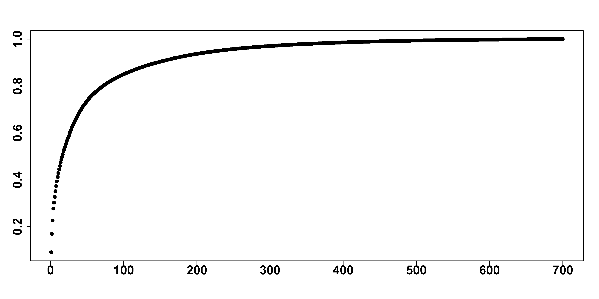

[](http://quantlet.de/)

## [](http://quantlet.de/) **FRM_per_cap** [](http://quantlet.de/)

```yaml

Name of Quantlet : FRM_per_cap

Published in : 'FRM: A Financial Risk Meter based on penalizing tail events occurrence'

Description : plot the percentage of market capitalization of 700 firms

Keywords : plot, percentage, firms, market, capitalization, financial, penalty, risk, tail,

Author : Lining Yu

Submitted : THU, December 15 2016 by Lining Yu

Datafile : companylist2016.csv

```




### R Code:
```r
############ FRM 100 firms ######################
rm(list = ls())
graphics.off()
# set the working directory 
# setwd('C:/...')

##################### Cap Plot ###################
cap = read.csv("companylist2016.csv")[, 4][1:700]
s_cap = rep(0, length(cap))
sum_cap = 0
for (i in 1:length(cap)) {
    sum_cap = sum_cap + cap[i]
    s_cap[i] = sum_cap
}

###### prozentage of cap ########
p_cap = rep(0, length(cap))
for (i in 1:length(cap)) {
    p_cap[i] = s_cap[i]/s_cap[length(s_cap)]
}
plot(p_cap, lwd = 5, pch = 20, xlab = " ", ylab = " ", cex.axis = 2, font.axis = 2)


```
